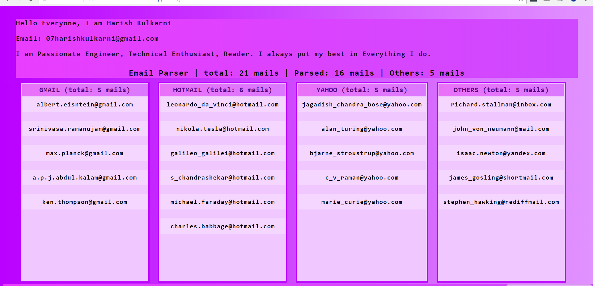

# email-parser-pure-JavaScript
###Plain Javascript
 An array of emails get parsed into group and will have detailed information about the users.
 Emails gets parsed according to their domain and grouped together. 
 This helps for large user database to know about their users, employees etc.

